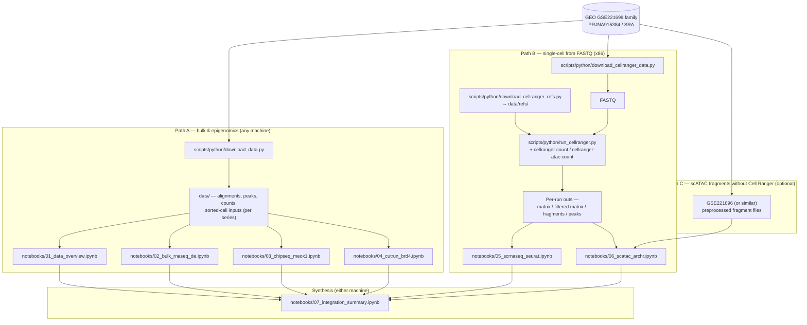
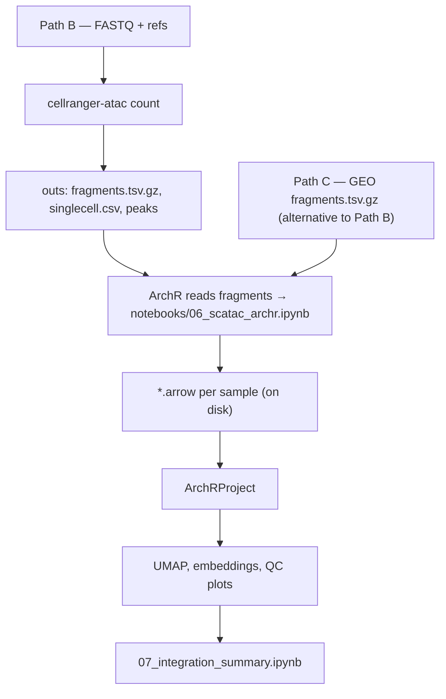

# End-to-end workflow

This page is a **map of inputs, scripts, tools, notebooks, and outputs** for the replication project. It complements the tables in [README.md](../README.md) and the detail in [STUDY_ANALYSIS_AND_REPLICATION_ROADMAP.md](../STUDY_ANALYSIS_AND_REPLICATION_ROADMAP.md).

**How to read it:** follow solid arrows for the default path. The scATAC notebook has two ways to obtain fragments (Cell Ranger from FASTQ vs. preprocessed GEO); only one is needed for a given run.

---

## 1. Executive pipeline (all modalities)

Shows how public records feed download scripts, where **Cell Ranger requires x86**, and how notebooks connect to the integration summary.

**Notes**

- **Path A:** ChIP/CUT&RUN in this repo are often analyzed from files produced under `data/`; external pipelines (e.g. nf-core) may sit between download and the notebooks depending on your setup—see the roadmap doc.
- **Path B vs. Path C for `06`:** use **either** Cell Ranger fragments **or** GEO fragments, not both as redundant inputs for the same cells.

---

## 2. scATAC detail (ArchR notebook)

Zooms in on **06** inputs: raw 10x pipeline vs. fragment files, and typical ArchR artifacts (regenerated when you re-run the notebook).

**Notes**

- **`.arrow` files** are ArchR’s on-disk Arrow format for fragments and derived matrices; they are large and reproducible from fragments—typically gitignored.
- **Spaces in paths:** ArchR is picky about spaces in `outputDirectory`; the notebook uses a no-space path where needed.

---

## Machine split (quick reference)

| Where | Typical work |
| ----- | ------------ |
| **ARM64 or x86** | Path A notebooks (01–04), 07 |
| **x86 only** | Path B downloads, Cell Ranger, 05–06 from FASTQ |

Same Conda environment can be used on both architectures; only Cell Ranger is x86-bound.
